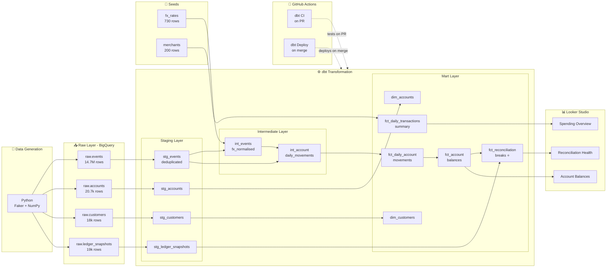
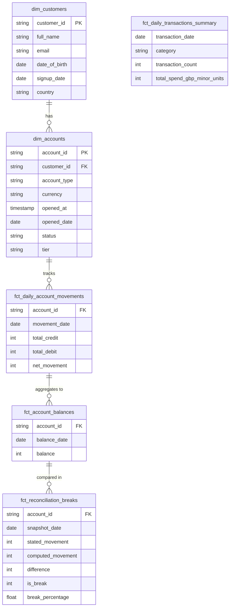

# 🏦 Fenzo Bank - Analytics Engineering Project

[](https://www.getdbt.com/)
[](https://cloud.google.com/bigquery)
[](https://www.python.org/)
[](https://github.com/sachin14596/fenzo-bank/actions)
[](LICENSE)

> A production-grade Analytics Engineering project simulating a UK neobank data warehouse - built with **dbt Core**, **Google BigQuery**, and **Looker Studio**. Demonstrates financial reconciliation, incremental modelling, and self-serve analytics at scale.

**[📊 Live Dashboard](https://datastudio.google.com/reporting/0fc8b2ec-3896-414f-816d-a5f2467f70c3)** | **[📖 dbt Docs](https://sachin14596.github.io/fenzo-bank/)** | **[🔍 Key Results](#key-results)**

---

## Architecture



---

## Business Problem

UK neobanks process millions of financial events daily - card payments, transfers, FX conversions. The core challenge is ensuring that **computed account balances** (derived from event streams) match **stated balances** (from the core banking ledger). Discrepancies indicate data quality issues, system bugs, or potential fraud.

This project simulates that exact problem:
- **14.7M synthetic events** across 18,000 customers, 12 months of activity
- A **reconciliation mart** that compares event-derived balances against ledger snapshots
- Automated **data quality tests** that fail the build if break rate exceeds threshold

> Fenzo Bank processes millions of financial events daily across 18,000+ customers. Ensuring data integrity between event-derived balances and the core banking ledger is critical for financial reporting and regulatory compliance.

---

## Key Results

| Metric | Value |
|--------|-------|
| Events processed | 14,737,596 |
| Accounts tracked | 20,696 |
| dbt models | 13 (staging → intermediate → marts) |
| Data tests | 59 (58 PASS, 1 WARN, 0 ERROR) |
| Reconciliation accuracy | **98.9%** genuine mismatch detection |
| Break rate | **4.04%** (threshold: 5%) |
| BigQuery optimisation | `cluster_by account_id` on fact tables |
| CI/CD | GitHub Actions - PR + deploy workflows |

---

## Tech Stack

| Layer | Technology |
|-------|-----------|
| Data Warehouse | Google BigQuery (`europe-west2`) |
| Transformation | dbt Core 1.8.2 + dbt-bigquery |
| Data Generation | Python 3.13 (Faker, NumPy, Pandas) |
| BI / Dashboard | Looker Studio |
| CI/CD | GitHub Actions |
| Version Control | Git + GitHub |
| dbt Packages | dbt_utils 1.3.0 |
| Credentials | GCP Service Account (encrypted GitHub Secret) |

---

## Data Model



---

## Key Design Decisions

| Decision | Rationale |
|----------|-----------|
| **Medallion + Kimball** | Staging (Silver) → Intermediate → Dimensional Marts (Gold). Star schema with `fct_` fact tables and `dim_` dimensions |
| **Month-over-month reconciliation** | Avoids opening balance issues - compares monthly movements, not absolute balances |
| **`insert_overwrite` incremental strategy** | Designed for append-only event data - replaces partitions, cheaper than `merge` at scale |
| **`europe-west2` region** | UK data residency - mirrors FCA regulatory requirements for UK financial data |
| **Auth balance reservation** | Card authorisations immediately reserve balance - prevents impossible negative balances |
| **Ground truth labelling** | ~2% deliberate ledger mismatches injected at generation - pipeline detects breaks independently, accuracy validated post-hoc |
| **Service account over OAuth** | Production standard - works in CI/CD without browser interaction |

---

## How to Run

### Prerequisites
- Python 3.10+
- Google Cloud account with BigQuery enabled
- GCP Service Account with BigQuery Admin role

### Setup

```bash
# 1. Clone the repo
git clone https://github.com/sachin14596/fenzo-bank.git
cd fenzo-bank

# 2. Create virtual environment
python -m venv venv
.\venv\Scripts\Activate  # Windows
source venv/bin/activate  # Mac/Linux

# 3. Install dependencies
pip install -r requirements.txt

# 4. Generate synthetic data
python generate_data.py        # generates raw CSVs (~15 min)
python generate_data_seeds.py  # generates seed CSVs

# 5. Load to BigQuery
bq load --source_format=CSV --autodetect --skip_leading_rows=1 \
    your-project:raw.events data/events.csv
# Load other tables via BigQuery Console

# 6. Configure dbt
# Create ~/.dbt/profiles.yml (see profiles.yml.example)
cd fenzo_dbt
dbt deps
dbt debug  # verify connection

# 7. Run the pipeline
dbt build --exclude resource_type:snapshot

# 8. View docs
dbt docs generate
dbt docs serve
```

### CI/CD
Every PR to `main` triggers `dbt build` automatically via GitHub Actions.
Every merge to `main` triggers full deploy + `manifest.json` artifact upload.

---

## Project Structure

```
fenzo-bank/
├── generate_data.py          # Synthetic event data generator
├── generate_data_seeds.py    # Reference data generator
├── requirements.txt
├── .github/workflows/        # CI/CD pipelines
│   ├── dbt_ci.yml           # PR checks
│   └── dbt_deploy.yml       # Production deploy
└── fenzo_dbt/               # dbt project
    ├── models/
    │   ├── staging/          # Cleaned source data (views)
    │   ├── intermediate/     # Joined/aggregated (views)
    │   └── marts/
    │       ├── finance/      # Reconciliation, balances
    │       └── analytics/    # Spending, customers
    ├── seeds/                # Reference data (fx_rates, merchants)
    ├── snapshots/            # SCD2 account history
    ├── macros/               # Reusable SQL (cents_to_pounds)
    └── tests/                # Singular business assertions
```

---

## Dashboard

**[📊 Live Dashboard - Looker Studio](https://datastudio.google.com/reporting/0fc8b2ec-3896-414f-816d-a5f2467f70c3)**

3 pages:
- **Spending Overview** - monthly spending by category
- **Account Balances** - average daily balance trends
- **Reconciliation Health** - 4.04% break rate, monthly trend

---

## License

MIT